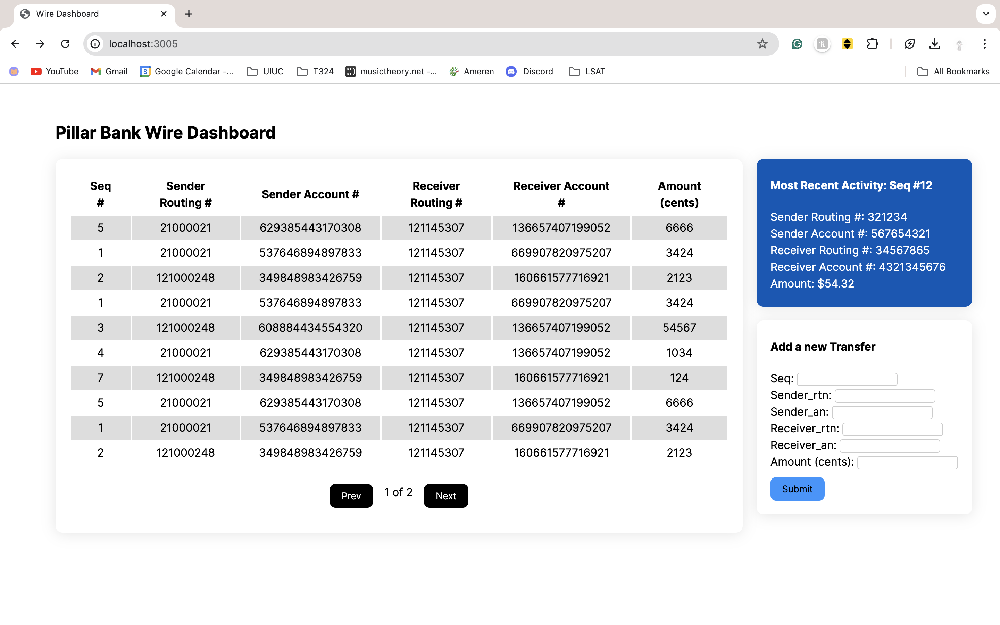

# Simple Wire Dashboard



## What's Used
- Go server with Gin
- React Vite client
- MySQL Database
- Typsescript
- Mantine, SWR React library 

## How to Run

### Prerequisits
- Go installed
- MySql server installed (https://dev.mysql.com/downloads/mysql/)

### PORT descriptions
- API Endpoints PORT 8080
- MySQL DB Server PORT 3306 (default)
- React Client App PORT 3005

### Run Application!

Start MySQL server and run 'wire-db.sql' to create a database on mysql server and insert test data
```
mysql -u root < wire-db.sql
```

Then start running Go server by runninig
```
go build main.go
go mod tidy
go run main.go
```

On a new terminal, go to client directory, run
```
yarn install
yarn add @mantine/form swr react-table
yarn dev --port 3005
```

go to http://localhost:3005 and play with the app!

### Things you can do on App
- sort table by each column by clicking on column headers
- go to previous or next page (each page can have 10 items)
- see the most recent message added (might need to wait or reload after adding a message)
- submit a new message 

## Notes

### Completed
- 3 API Endpoints implemented in Go(lang)
- Data stored in MySQL Database
- React based front-end with a sortable table with pagination

### Incompleted
- Adding an auth to work

### What I Would Do Differently
- Not using SWR for POST request from React: SWR is intended to make GET requests; though it works currenlty, it's not the best practice and there are other libraries available
- Not using react-table for sortable table with pagination: known issue with fetch 
- Use more open source front-end componentes to reduce the time spent on front-end development
- I misread the minimum requirements of the case study in the beginning, which led to poor priority management
- Improve how to run this app with simpler scripts to minimize terminal commands given more time
